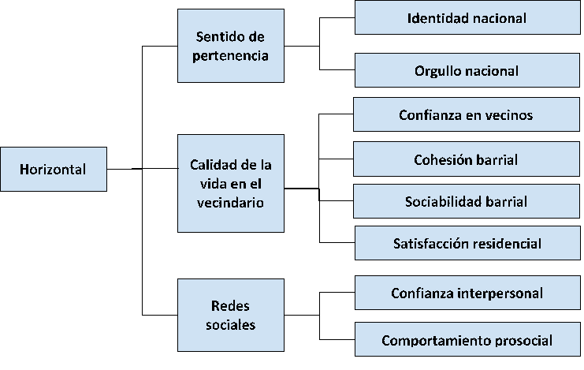
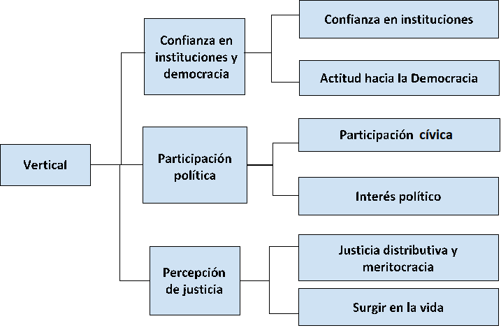

---
editor_options:
  markdown:
    wrap: 72
---

# Resumen propuesta de medición

EL resumen de esta propuesta de medición de cohesión social con ELSOC toma como referencia la conceptualización de @chan_Reconsidering_2006 en dos dimensiones generales: (1) Vertical y (2) Horizontal.

*"La cohesión social es un estado de cosas que concierte tanto a las interacciones verticales como horizontales entre los miembros de la sociedad, caracterizado por un conjunto de actitudes y normas que incluyen la confianza, el sentido de pertenencia y la voluntad de participar y ayudar, así como sus manifestaciones conductuales"* [@chan_Reconsidering_2006, pp. 290]

## Horizontal

La dimensión horizontal está dirigida hacia la cohesión dentro de la sociedad civil y posee indicadores subjetivos y objetivos. Los indicadores subjetivos incluyen la cohesión entre los ciudadanos individuales, así como la cohesión entre diferentes grupos sociales, mientras que los indicadores objetivos incluyen cómo se manifiesta la cohesión, a partir del grado de participación social de las personas.

## Vertical

La dimensión vertical está dirigida hacia la cohesión entre los ciudadanos (o sociedad civil) y el Estado y posee indicadores subjetivos y objetivos. Los indicadores subjetivos miden la confianza de las personas hacia las principales autoridades públicas y hacia las instituciones políticas y sociales, mientras que los indicadores objetivos están asociados con las conductas de las personas, a partir de la participación política.

